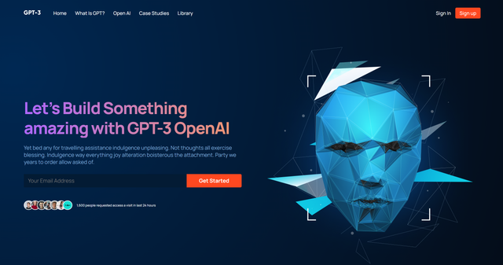

# GPT-3



# Project Setup Instructions

Follow the steps below to set up the React project after cloning from GitHub.

## Prerequisites

Ensure you have the following installed on your system:

- **Node.js**: [Download Node.js](https://nodejs.org/)
- **npm** (Node Package Manager) or **Yarn** (optional): Comes with Node.js, but you can also use [Yarn](https://yarnpkg.com/) if preferred.

## Steps to Set Up

1. **Clone the Repository**

   Clone the repository from GitHub to your local machine using the command:

   ```bash
   git clone <repository-url>
   ```

   Replace `<repository-url>` with the URL of the GitHub repository.

2. **Navigate to the Project Directory**

   Change your directory to the newly cloned project directory:

   ```bash
   cd <project-directory>
   ```

   Replace `<project-directory>` with the actual directory name of your project.

3. **Install Dependencies**

   Install all necessary dependencies for the project using npm or Yarn:

   - Using npm:

     ```bash
     npm install
     ```

   - Using Yarn:

     ```bash
     yarn install
     ```

4. **Start the Development Server**

   Start the React development server to run the project:

   - Using npm:

     ```bash
     npm start
     ```

   - Using Yarn:

     ```bash
     yarn start
     ```

   This command will start the application and automatically open it in your default browser. If it doesn’t open automatically, visit [http://localhost:3000](http://localhost:3000) in your browser.

## Additional Information

- **Build the Project**: To create a production build, use the following command:

  - Using npm:

    ```bash
    npm run build
    ```

  - Using Yarn:

    ```bash
    yarn build
    ```

  This will create an optimized build of your project in the `build` directory.

- **Testing**: Run tests using:

  - Using npm:

    ```bash
    npm test
    ```

  - Using Yarn:

    ```bash
    yarn test
    ```

## Troubleshooting

If you encounter issues during the setup process, consider the following:

- Ensure all dependencies are installed.
- Check for any error messages in the terminal and resolve them accordingly.
- Make sure the correct version of Node.js is installed as per the project’s `.nvmrc` file or documentation (if available).

For further assistance, contact the project maintainer or consult the [React documentation](https://reactjs.org/docs/getting-started.html).
```

This file includes the necessary steps to set up a React project after cloning from GitHub, including installing dependencies, starting the development server, building the project, and testing. Adjust the instructions as needed to match your project’s specific requirements.